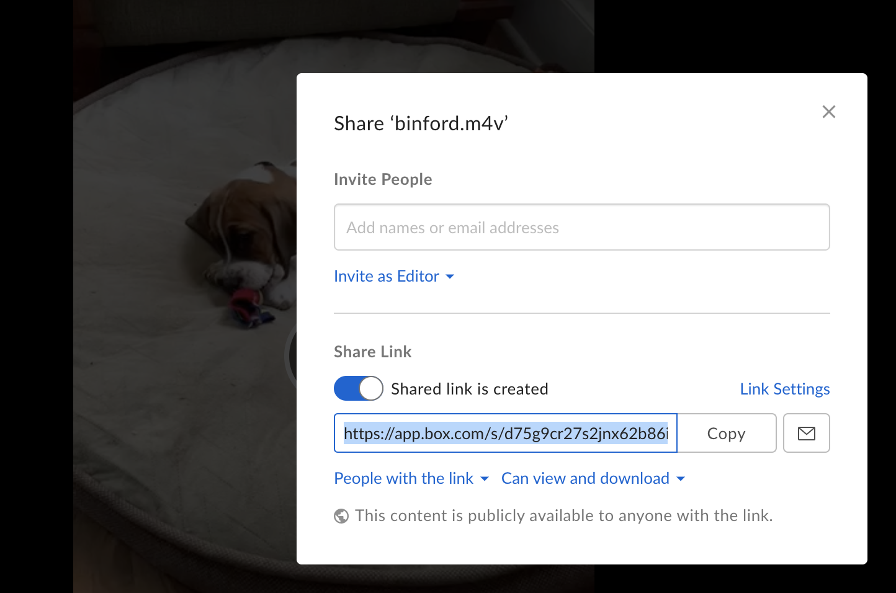

```{r setup, include = FALSE}
knitr::opts_chunk$set(
  collapse = TRUE,
  comment = "#>"
)

library("htmltools")
library("fs")
```

```{r}
library("vembedr")
```

Using this package, you can embed videos into RMarkdown documents and Shiny apps for videos from:

- [YouTube](https://developers.google.com/youtube/player_parameters)
- [Vimeo](https://developer.vimeo.com/player/embedding)
- [Channel 9](https://channel9.msdn.com/Events/useR-international-R-User-conference/useR2016/Forty-years-of-S), which includes the UseR! 2016 and 2017 videos. Click the *Embed* tab for embedding options.
- [Box](https://developer.box.com/docs/box-embed#section-build-box-embed-programatically)

The links above are associated with the embedding API for each of the services; these are the APIs wrapped by the
`embed()` functions in this packages.  In many cases it may be easier to embed by using only URL of the page your video is on, using `embed_url()`.

To set the start time, or to change the formatting, check out the `use_*()` functions in `vignette("modify")`.

## Embded using URL

Although a URL can be long and awkward, it will get the job done. If the URL is from one of the supported services, it should *just work*:

```{r}
embed_url("https://www.youtube.com/watch?v=uV4UpCq2azs")
```

If you would like to generate more-concise code using the URL, you can use the `suggest_embed()` function:

```{r}
suggest_embed("https://www.youtube.com/watch?v=uV4UpCq2azs")
```

## Embed by service

### YouTube

You can get your video's identifier by inspecting its URL at YouTube - you can use the short version, as well:

```{r}
suggest_embed("https://youtu.be/JeaBNAXfHfQ")
```

The identifier is the last part of the URL. To embed this video:

```{r}
embed_youtube("JeaBNAXfHfQ")
```

### Vimeo

For Vimeo, the identifier is also included in the standard URL:

```{r}
suggest_embed("https://vimeo.com/238200347")
```

The Vimeo identifier is the path part of the URL:

```{r}
embed_vimeo("238200347")
```

### Channel 9

The UseR! 2016 and 2017 videos are hosted on Microsoft's Channel 9 service, motivating this embed function.

Personal note: one of the things I want to well-and-truly understand (along with non-standard evaluation) is monads. I understand it to be a useful construct for managing side-effects, but true understanding escapes me. This is a great video; it gets me 95% of the way there (I think), so maybe repeated viewings will get me sufficiently close.

Here's the URL:

```{r}
suggest_embed(
  "https://channel9.msdn.com/Shows/Going+Deep/Brian-Beckman-Dont-fear-the-Monads"
)
```

The identifier is the path of the URL, **`Shows/Going+Deep/Brian-Beckman-Dont-fear-the-Monads`**, which you can express as a string:

```{r}
embed_channel9("Shows/Going+Deep/Brian-Beckman-Dont-fear-the-Monads")
```

Alternatively, you can express this as a vector of strings:

```{r eval=FALSE}
embed_channel9(c("Shows", "Going+Deep", "Brian-Beckman-Dont-fear-the-Monads"))
```

#### UseR! 2016 (and 2017)

At UseR! 2016, Rick Becker gave a wonderful talk on the history of the S language:

```{r echo=FALSE}
tags$p(
  tags$code(
    HTML(paste0(
      "https://channel9.msdn.com/Events/useR-international-R-User-conference/useR2016/",  
      tags$strong("Forty-years-of-S")
    ))
  )  
)
```

For a UseR!2016 (or 2017) video, the identifier is the last component of path of the URL, in this case: **`Forty-years-of-S`**. To embed the video:

```{r}
embed_user2016("Forty-years-of-S")
```

### Box

To share a video on Box, the video file itself will have to be shared. From the Box web-interface, you can do this by clicking the **Share** button at the top-right corner of your file's web-page. Then create a **Share Link**: 

```{r out.width="100%", echo=FALSE}

```

Then, you need to capture some information about the embed-link itself, either the URL or the `id`. Please note that you need to work with the "ugly" URL, not a custom URL: 

```{r}
suggest_embed("https://app.box.com/s/d75g9cr27s2jnx62b86idpgffzzxfdt2")
```

You can do the same thing using the `embed_box()` function and the `id`. The Box identifier is the last part of the path.


```{r}
embed_box("d75g9cr27s2jnx62b86idpgffzzxfdt2")
```

If you are using a corporate instance of Box, and use the `embed_box()` function, you will also have to specify the `custom_domain`. For example, if your URL starts with `"https://acme.app.box.com"`, then your `custom_domain` is `"acme"`.

## Microsoft Stream

```{r}
embed_msstream("ae21b0ac-4a2b-41f4-b3fc-f1720dd20f48") %>%
  use_start_time(10)
```

## Sample videos

In case you need sample videos with which to experiment, this package has you covered:

```{r}
rickroll_youtube()
```

Also (mercifully, not displayed):

```{r eval=FALSE}
rickroll_vimeo()
```

```{r eval=FALSE}
rickroll_channel9()
```
